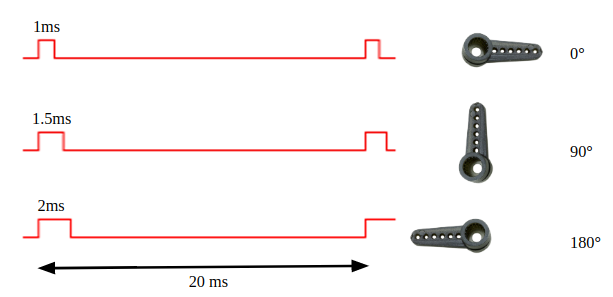

# INTERNET ENABLED SECURITY SYSTEM

A camera enabled security system having both local autonomous and remote manual control capabilities\.

	

# FEATURES

* Livecamerafeed streaming
* Auto unlock with face identification
* Remote control using Android application
  * Access control
  * Access logging
  * Camera orientation control

# MAIN HARDWARE COMPONENTS

* Raspberry Pi
  * __SoC__  __:__ Broadcom BCM28373 Model B
  * __CPU__  __:__ 1\.2GHz Quad\-coreARMCortex\-A53                                                              \(50% faster than Raspberry Pi 2\)
  * __GPU:__ BroadcomVideoCoreIV
  * __RAM:__ 1GB LPDDR2 \(900MHz\)
  * __GPIO:__ 40\-pinheader
  * __Networking__  __:__
    * 10/100 Ethernet
    * 2\.4GHz802\.11nWiFi
  * __Bluetooth:__ Bluetooth 4\.1Low Energy
  * __Ports:__ HDMI\, Audio\-videojack\,4USB 2\.0\,Ethernet\, CameraSerial Interface \(CSI\)\, Display Serial Interface \(DSI\)

* Raspberry Pi Camera Rev 1\.3
  * __Still resolution__ : 5 Megapixels
  * __Video modes__ :1080p @ 30 fps\, 720p @ 60 fpsand640×480 @ p60/90 fps
  * Plugs into CSI Connector of RaspberryPi
  * __Size__ :Around 25 × 24 × 9 mm
  * __Weight__ : 3g

* Pan & Tilt Module
  * 2 x SG90 servo
    * __Operating__  __Voltage__ : \+5V
    * __Torque__ : 2\.5kg/cm
    * __Operating__  __speed__ : 0\.1s/60°
    * __Gear Type__ : Plastic
    * __Rotation__ :0°\- 180°
    * __Weight__ :9gm

---

# SYSTEM OVERVIEW

# LIVE STREAMING

  * Using Raspberry Camera & UV4L streamer software
  * <ins>U</ins>ser space <ins>V</ins>ideo <ins>4L</ins>inux
    * __User space__ driversfor real or virtual video input and outputdevices
    * Includes genericpurpose _Streaming Server_ plug\-in\, especially made forIoTdevices\.

# FACE IDENTIFICATION ALGORITHM

Get image from the camera

Detect faces in the image usingHaarCascade Classifier

Quantify each face to construct128\-dembeddingsusingdlibneural network

Classify face using k\-NearestNeighbourmethod

# FACE IDENTIFICATION ALGORITHM HAAR CASCADE CLASSIFIER

Machinelearning based approach where a cascade function is trained from a lot of positive and negative images\. It is then used to detect objectsin images\.

HAAR CASCADE CLASSIFER

# FACE IDENTIFICATION ALGORITHM CREATING FACE EMBEDDINGS

Quantify faces into 128\-d embedding usingdlibpre\-trained neural network\.

The neural network has been trainedona dataset of ~3 millionimages using deep\-metriclearning \(99\.38% accuracy\)\.

# FACE IDENTIFICATION ALGORITHM K-NEAREST NEIGHBOUR CLASSIFICATION

Find Euclidean distance between the embeddings and already stored embeddings of known faces\.

Identify the face based on minimum distance\.

# FACE IDENTIFICATION ALGORITHM SUMMARY

HAAR CASCADE CLASSIFER

# ACCESS CONTROL & LOGGING

# ACCESS CONTROL PUSH NOTIFICATIONS

Pushy Cloud Messaging Service

Offerscross\-platformreliablenotification delivery

Based on light\-weight MQTT protocol

# ACCESS CONTROL PUSH NOTIFICATIONS BACKEND

Raspberry Pi

API HTTP POST Request using Python

* __API__  __Endpoint__
* POSThttps://api\.pushy\.me/push?api\_key= __SECRET\_API\_KEY__
* __Request__  __Headers__
* Content\-type:application/json
* __JSON Payload__
  * \{
  * 'data': \{
  * 'message' : __MESSAGE__ \,
  * 'username' : __USERNAME__
  * \}\,
  * 'to': '/topics/ __BROADCAST\_TOPIC__ '
  * \}

# ACCESS CONTROL PUSH NOTIFICATIONS CLIENT

Android Application

Android __BroadcastReceiver__ Service  running in the background

# ACCESS LOGGING

Access history saved to a file in Raspberry Pi

File hosted on Apache HTTP Server running on Raspberry Pi

Accessed remotely by Android Application

# CAMERA ORIENTATION CONTROL

Using 2 SG90 servo motors attached to pan & tilt module

Connected to Pi PWM pins

Controlled remotely using Android Application

GET Request send to Pi web server based on user input \(← / → / ↑ / ↓ \)

Handled by PHP script controlling Pi PWM duty cycle

# CAMERA ORIENTATION CONTROL DC SERVO MOTOR

# IMPROVEMENTS FOR THE PROJECT

Real\-time streaming FPS can be improved by usingWebRTCprotocol

Camera settings can be adjusted automatically based on time and light based to improve visibility

Provision to add and remove authenticated users can be added

Centroid tracking can be included to track objects

Android application can be ported to other platforms

# SCOPE OF THE PROJECT

Face identification based attendance system

Multiple security cameras can be used for tracking a specified object by including M2M technology

